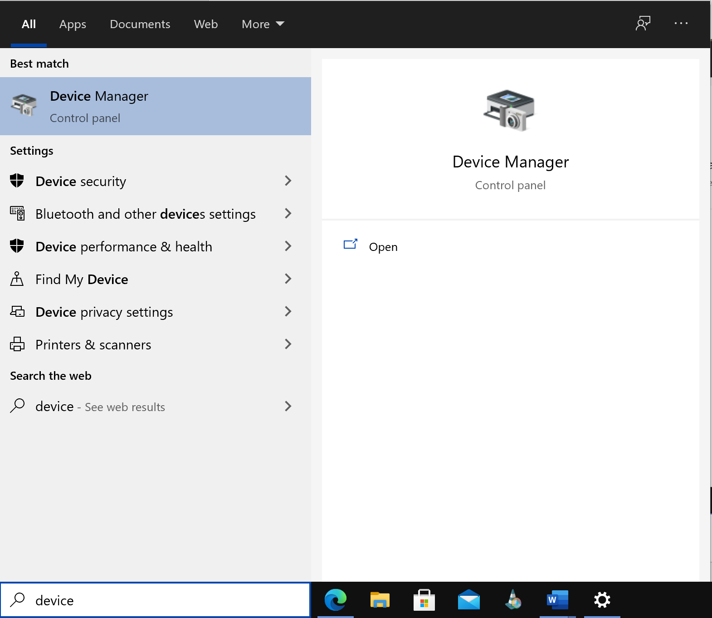
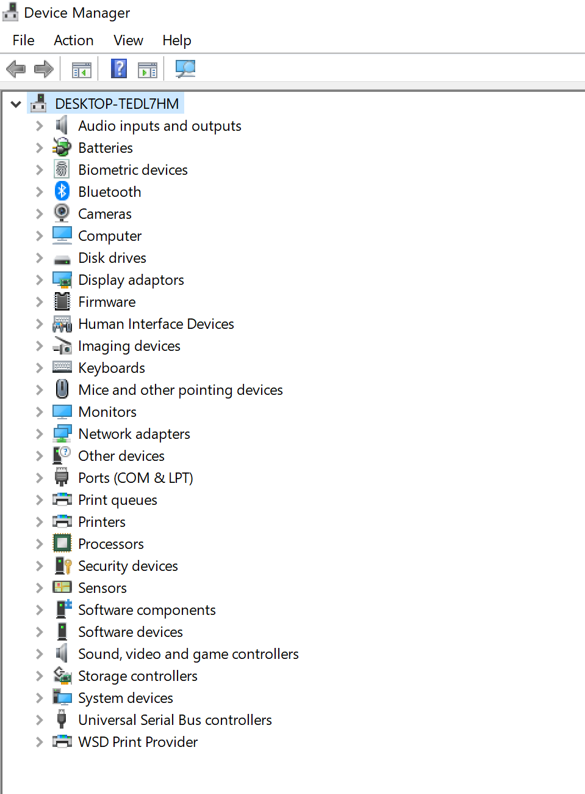
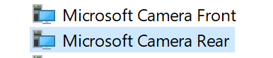
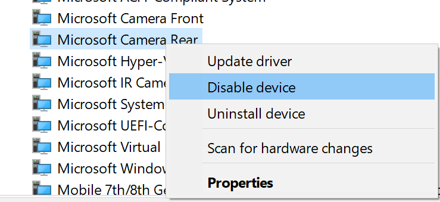
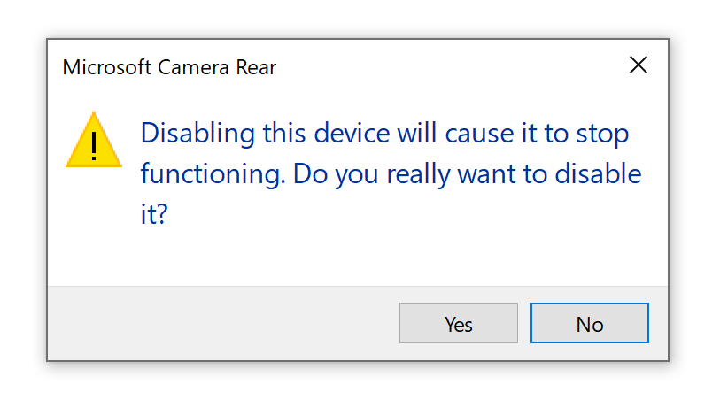
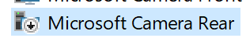
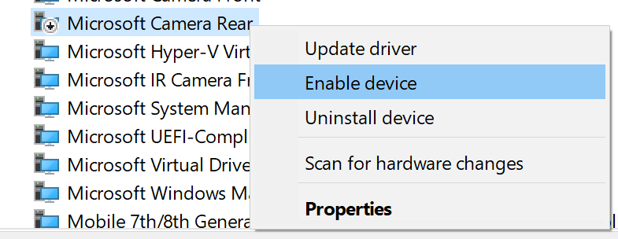

## Camera

Please make sure that your camera is working for the video proctoring. 

**Infrastructure Testing**: The SEB, depending on your operating system, may not display you in the video (when clicking on the profile-icon at the bottom in the taskbar). To make sure that the camera is working, log into the test at the same time as a fellow student and check if you can see each other to make sure the video proctoring is working. 

**During the exam**: If you feel that the video proctoring is not working during an exam, but you are able to take the exam/mock exam: **Continue to take the exam / mock exam! We will contact you if something doesn't work. You do not need to contact us!**

### Deactivate rear camera

If your device has **several** cameras, it is important to turn off the camera on the **rear of the device**.

1. Click on "Start" / the "Windows icon" and enter "Device Manager" in the search bar.

1. Open the "Device Manager" and look for "System Devices".

1. Click on "System Devices" and search for the cameras (i.e. Microsoft Camera Rear). 

**Note:** If you are unable to locate the camera within the "System Devices" look for **Imaging Devices** instead and follow the steps below.

1. Disable the camera on the rear of the device by doing a "right-mouse-click" on the respective camera and select "disable".

1. A pop-up will be displayed, asking you whether you are sure to deactivate the camera. Press **Yes**

1. The camera is now displayed as **deactivated**

**Note**: If you want to reactivate your camera, follow the instructions above again, but click on "enable" in point 4

