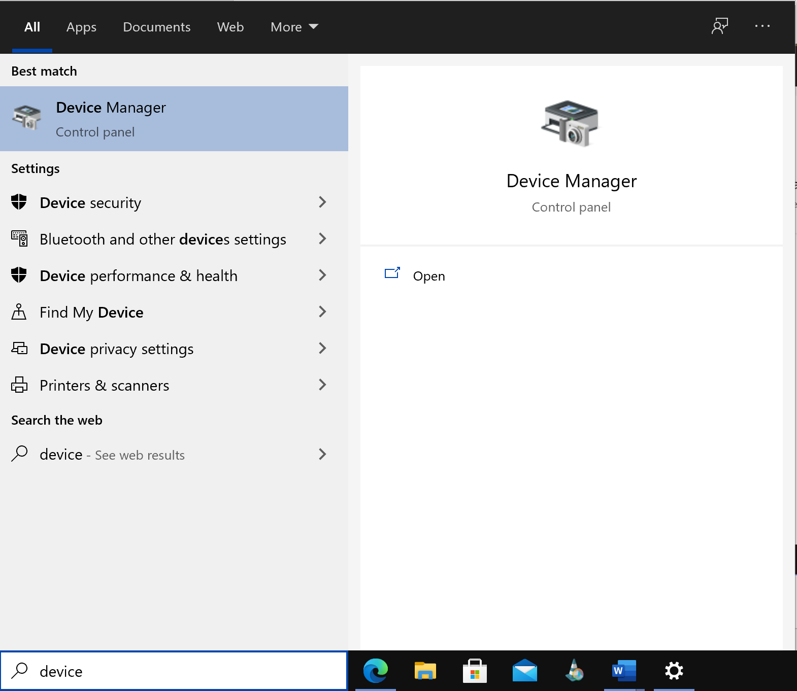
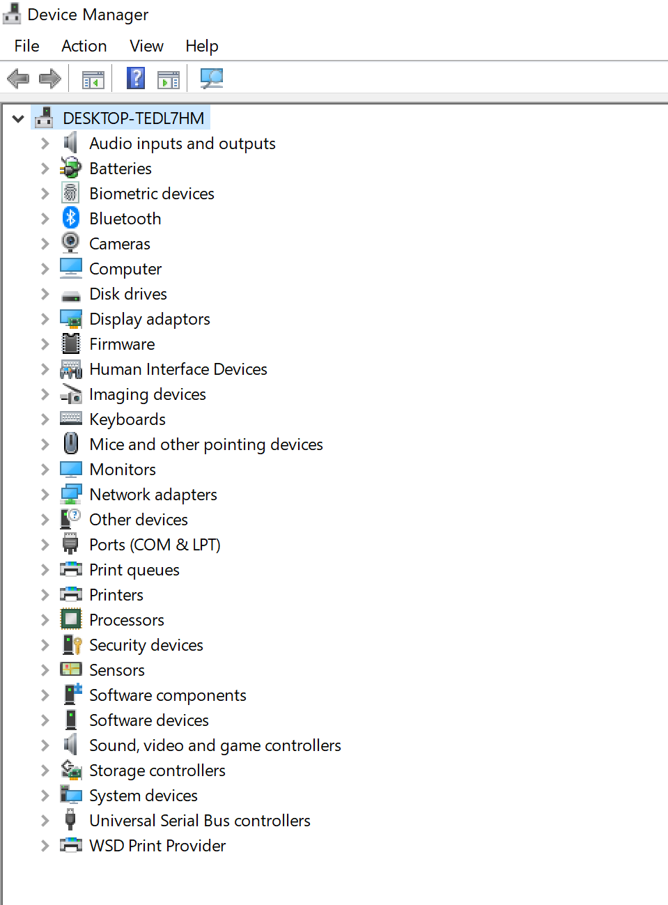
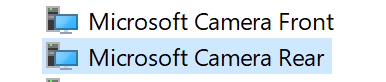
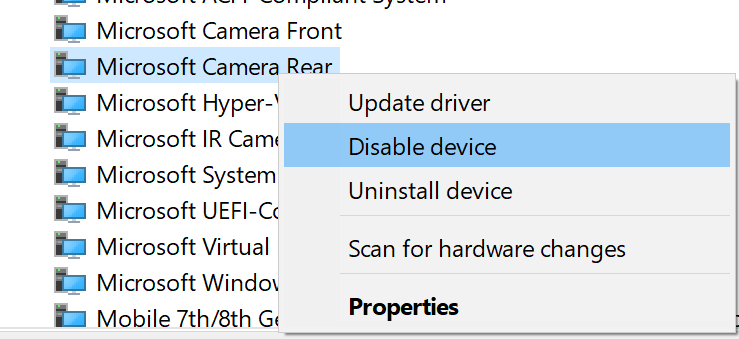
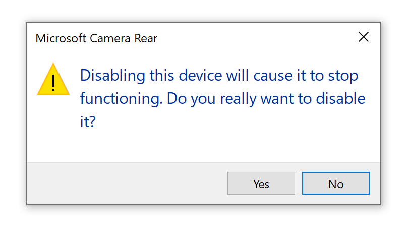
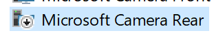
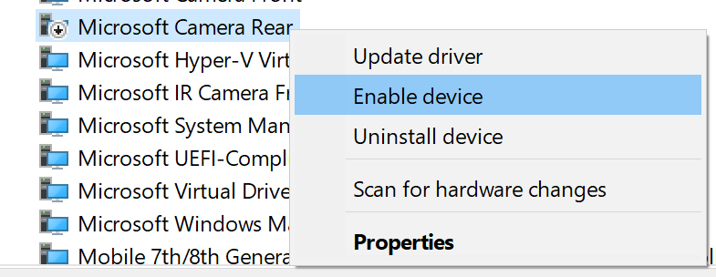

## Kamera

Bitte stellen Sie sicher, dass Kamera für das Proctoring funktioniert. 

**Infrastruktur Testing**: Im SEB, sehen Sie sich je nach Betriebssystem nicht selber (Profilicon unten in der Taskleiste). Um sich zu vergewissern, dass die Kamera für die Video Überwachung funktioniert, ist es am einfachsten, wenn Sie sich zeitgleich mit einer Mitstudentin / einem Mitstudenten einloggen und gegenseitig prüfen, dass Sie die andere Person sehen können. 

**Während der Prüfung**: Falls Sie während der Prüfung oder der Probeprüfung das Gefühl haben, dass die Videoüberwachung nicht funktioniert, Sie aber die Prüfung / die Probeprüfunge absolvieren können: **Lösen Sie die Prüfung / die Probeprüfung weiter! Wir melden uns bei Ihnen, falls etwas nicht funktioniert. Sie müssen sich nicht melden!**

### Kamera deaktivieren

Sollte Ihr Endgerät **mehrere** Kameras ausweisen, ist es wichtig die Kamera auf der **Rückseite des Gerätes** ausgeschaltet ist

1. Klicken Sie auf "Start" bzw. auf das "Windows-Symbol" und geben Sie in das Suchfeld "Geräte-Manager" (engl. Device Manager) ein. Klicken Sie auf den Eintrag.

1. Im Fenster "Geräte-Manger" suchen Sie den Eintrag "Systemgeräte" (engl. System Devices). Klicken Sie darauf. 

1. Unterhalb des Eintrags erscheinen alle Systemgeräte. Suchen Sie nach den Kameras des Geräts. 

1. Deaktivieren Sie die Kamera auf der **Rückseite** (engl. Rear camera) des Gerätes, in dem Sie  mit der rechten Maustaste auf den Eintrag dieser Kamera und anschließend auf "deaktiveren" (engl. disable) klicken.

1. Eventuell wird ein Pop-Up angezeigt, welches Sie darauf hinweist, dass Sie die Kamera deaktivieren und somit nicht mehr nutzen können

1. Die Kamera wird nun als "deaktiviert" angezeigt

**Hinweis**: Wenn Sie Ihre Kamera wieder aktivieren wollen, folgen Sie der obigen Anleitung erneut, klicken aber auf "aktivieren" (engl. enable) in Punkt 4

