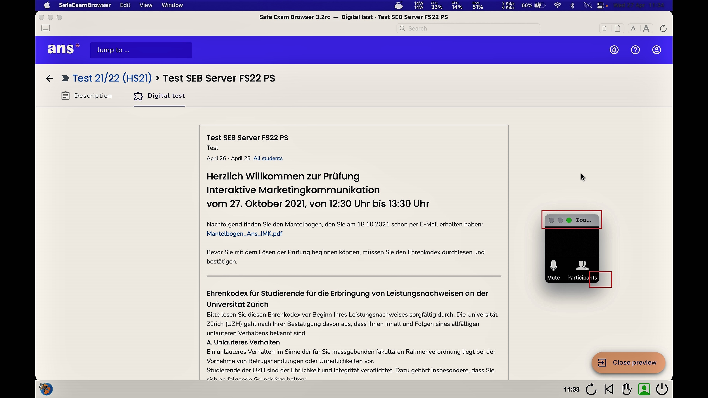
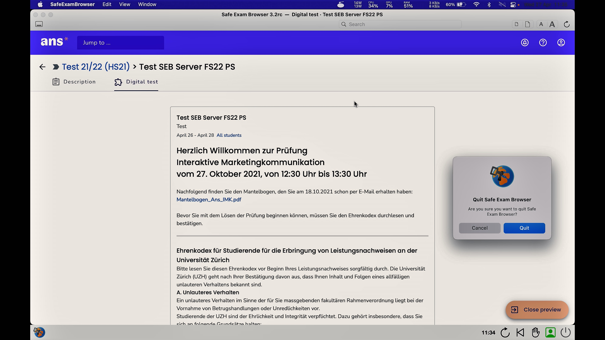

## SEB mit Ans (MacOS)

### Start der Prüfung
Bitte beachten Sie die Checkliste unter [Allgemeine Informationen](https://uzh-oec.github.io/seb/exam_general_de.html){:target="_blank"}

1. Sie erhalten zeitnah zu jeder Prüfung eine Konfigurationsdatei auf folgender Website: [https://oec.uzh.ch/de/seb](https://oec.uzh.ch/de/seb){:target="_blank"}

1. Klicken Sie auf die Schaltfläche **DATEINAME starten**

1. Während der SEB startet, zeigt sich ein Pop-Up, welches darauf hinweist, dass ein Videoüberwachung stattfindet. Drücken Sie **OK**       

1. Als Nächstes lädt der SEB die Ans Plattform. Wählen Sie die Login-Option "Login with school account" und geben Sie **Zurich** oder **UZH** ein und wählen **University of Zurich (UZH)** aus

1. Bitte loggen Sie sich mit dem SWITCHaai Login ein

1. Bei erfolgreichem Login wird Ihnen innerhalb der Ans Plattform  die Prüfung direkt angezeigt, sodass Sie den Ehrenkodex sehen (falls die Prüfung noch nicht Live ist, sehen Sie diese **nach** dem Countdown)

**Hinweis**: sollte die Prüfung nicht direkt angezeigt werden, suchen Sie nach der Prüfung:
* Hat die Prüfungszeit noch nicht begonnen, finden Sie die Prüfung unter **Scheduled assignments**
* Hat die Prüfung bereits gestartet, finden Sie die Prüfung unter **Live assignments**
Alle weiteren Informationen zu Ans finden Sie [hier](https://uzh-oec.github.io/ans/exam-navigation-de.html){:target="_blank"}

1. Zusätzlich öffent sich das **Zoom Meeting**. 

1. Es wird empfohlen, dass Sie:
* den Ton Ihres Gerätes abschalten
* das Fenster **verkleinern** und auf die linke oder rechte Seite des Bildschims schieben

1. Die Prüfung wird nun angezeigt.
Alle weiteren Informationen zu Ans finden Sie [hier](https://uzh-oec.github.io/ans/exam-navigation-de.html){:target="_blank"}

### Beenden der Prüfung
 
Sie dürfen den Safe Exam Browser **nicht** vor Prüfungsende beenden. Ein vorzeitiger Ausstieg aus dem Safe Exam Browser gilt als Prüfungsbetrug. Klicken Sie **NICHT** auf den Button «Safe Exam Browser schliessen» bevor die Prüfungszeit abgelaufen ist.

**Hinweis**: Wenn Sie die Prüfung beenden, kommt eine Fehlermeldung, dass der Safe Exam Browser unerwartet beendet wurde. Klicken Sie hier bitte **OK**

### Während der Prüfung

Der Safe Exam Browser weist am unteren Rand Symbole auf.

**Unten rechts:**
* Zeit
* Aktualisierungssymbol
* Exit

