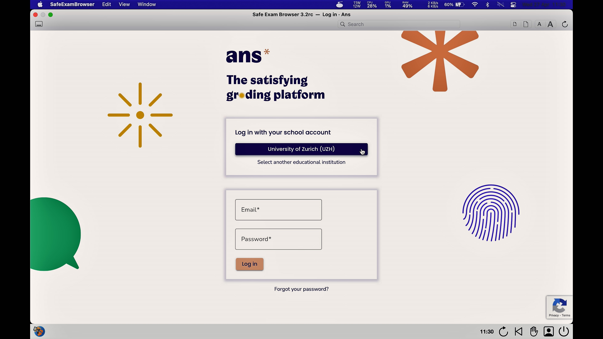

## SEB & Ans (MacOS)

This documentation explains how to use the Safe Exam Browser in an **Ans** exam.

### Start an exam
Please make sure you have gone through the checklist before starting the exam [general information](https://uzh-oec.github.io/seb-en/exam_general_en.html){:target="_blank"}

1. You will be provided a **configuration file** for the exam on the following website: [https://oec.uzh.ch/de/seb](https://oec.uzh.ch/de/seb){:target="_blank"}

1. Once you are on the above website, go to the section **module specific information** and select your module at the bottom of the page.

1. On the respective module page you will find several testing runs as well as the exam listed. Go to the respective section you need the configuration file for and select **FILENAME starten** 

1. The configuratoin is loading and starting the SEB

1. During the start of the SEB a pop-up is indicating that you are being proctored. Please click **OK**       

1. In a next step SEB is loading the Ans software. Please choose the option "Login with school account". For faster selection of **University of Zurich (UZH)** type **Zurich** or **uzh** in the search bar

1. Log in with your SWITCHaai

1. In addition to Ans the SEB opens a **Zoom Meeting** for procotoring (also see the profil-icon on the bottom right). 

1. Please make the following adjustments:
* mute the sound on your device but **DO NOT** mute the microphone within the zoom window.
* make sure the camera is on by checking the "light" indication

1. After the successful login to the ans plattform the exam is being displayed within the SEB. If you click on the exam the code of honor is displayed (if the exam is not yet live, you are seeing a countdown instead) 

**Note**: if the exam is not (correctly) displayed, look for the exam within the Ans landing page (click on the ans logo in the top left corner): 
* If the exam time has not yet started, look for the exam within the section **Scheduled assignments**
* If the exam time has already started, look for the exam within the secton **Live assignments**

1. You are now able to take the exam. You can find additional information on Ans on the website [here](https://uzh-oec.github.io/ans/exam-navigation-en.html){:target="_blank"}

### During an exam

The safe exam browser has a task bar at the bottom, where the following 

* Time
* Profil-Icon: this entails the video-proctoring. Depending on the settings made by the administrator you can click on it and are then able to see other people in the zoom room
* Refresh-Icon
* Exit- Button: when pressing the button, a password is requested, which only the administrator has. Since exiting the Safe Exam browser is not allowed, you must select **Cancel** in the pop-up when you press the button. Exiting the Safe Exam Browser AFTER submitting the exam is done with a button appearing in the Ans plattfrom: see chapter **Finish an exam** below

### Finish an exam
 
You are **not** allowed to quit the Safe Exam Browser before the end of exam time slot. Early exit from the Safe Exam Browser is considered exam fraud. Do **NOT** select the button «End Safe Exam Browser» before the exam time has elapsed.

**Mote**: When quitting the SEB using a MacOS, an pop-up appears containing an error message "Safe Exam Browser quit unexpectely". Please select **OK**

