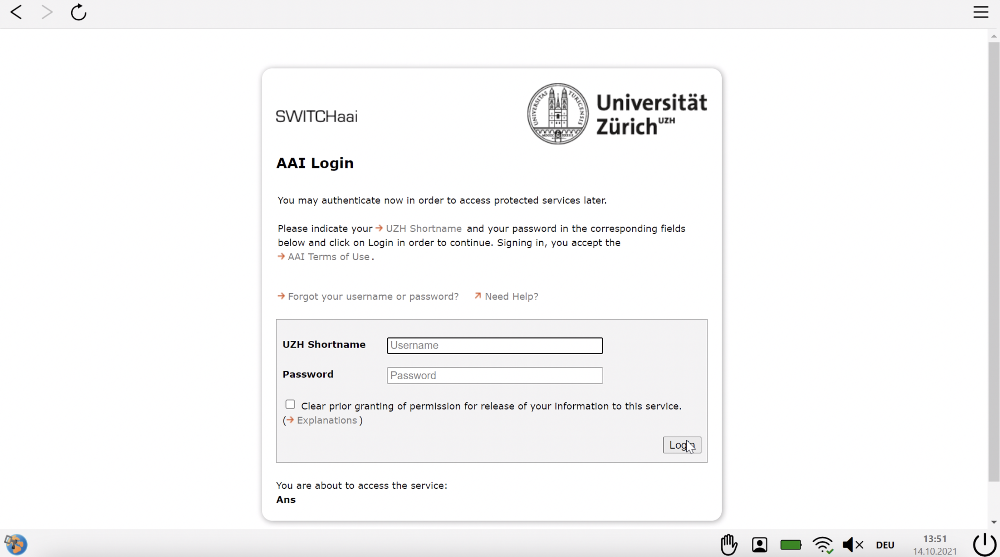

## Ans & SEB (Windows)
{: .no_toc }

This documentation explains how to use the Safe Exam Browser in an **Ans** exam.

1. Inhaltsübersicht
{:toc}

---

### Start an exam
Please make sure you have gone through the checklist before starting the exam [general information](exam_general)

1. You will be provided a **configuration file** for the exam on the following website: [https://www.oec.uzh.ch/en/seb](https://www.oec.uzh.ch/en/seb){:target="_blank"}

1. Once you are on the above website, go to the section **module specific information** and select your module at the bottom of the page.

1. On the respective module page you will find several testing runs as well as the exam listed. Go to the respective section you need the configuration file for and select **FILENAME starten** 

1. The configuratoin is loading and starting the SEB

1. During the start of the SEB a pop-up is indicating that you are being proctored. Please click **OK**       

1. SEB is starting

1. You will briefly see the following

1. In a next step the SEB is loading the Ans software. Please choose the option "Login with school account". For faster selection of **University of Zurich (UZH)** type **Zurich** or **uzh** in the search bar

1. Log in with your SWITCHaai

1. In addition to Ans the SEB opens a **Zoom Meeting** for procotoring: see the profile icon on the bottom right. 

1. Please make the following adjustments:
* mute the **sound** on your device but **DO NOT** mute the **microphone** within the zoom window.
* make sure the **camera** is **on** by checking the "light" indication.

1. After the successful login to the ans plattform the exam is being displayed within the SEB. If you click on the exam the code of honor is displayed (if the exam is not yet live, you are seeing a countdown instead)
**Note**: if the exam is not displayed (correctly) (e.g. error message "Access denied" / "Incorrect configuration detected), click on the **ans** logo at the top left and look for the exam within the Ans landing page (click on the ans logo in the top-left corner): 
* If the exam time has not yet started, look for the exam within the section **Scheduled assignments**
* If the exam time has already started, look for the exam within the secton **Live assignments**

1. You are now able to take the exam by accepting the code of honor and pressing the **Start**-button. You can find additional information on Ans [here](https://uzh-oec.github.io/ans/exam-navigation-en.html){:target="_blank"}

A detailed overview regarding icons and their function can be found here:
[Icons explained](icons_explained)

### During an exam

Safe Exam Browser provides a variety of functions which, depending on the version, are displayed either on top or on the bottom of SEB or might not be available at all.

A detailed overview regarding icons and their function can be found here:
[Icons explained](icons_explained)

### Finish an exam
 
You are **not** allowed to quit the Safe Exam Browser (use the exit button on the bottom right) before the end of exam time slot. Early exit from the Safe Exam Browser is considered exam fraud. Do **NOT** select the button «End Safe Exam Browser» before the exam time has elapsed.

