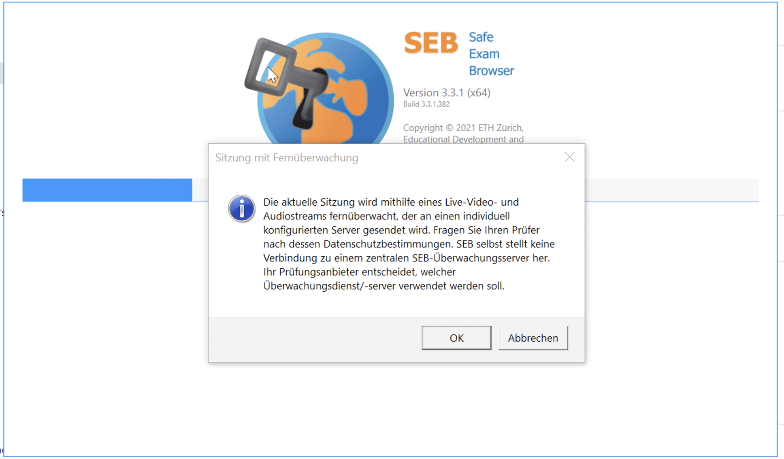
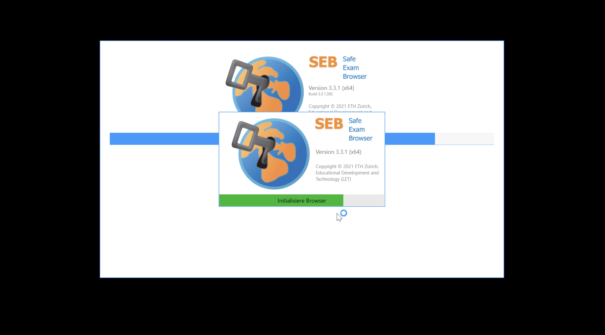
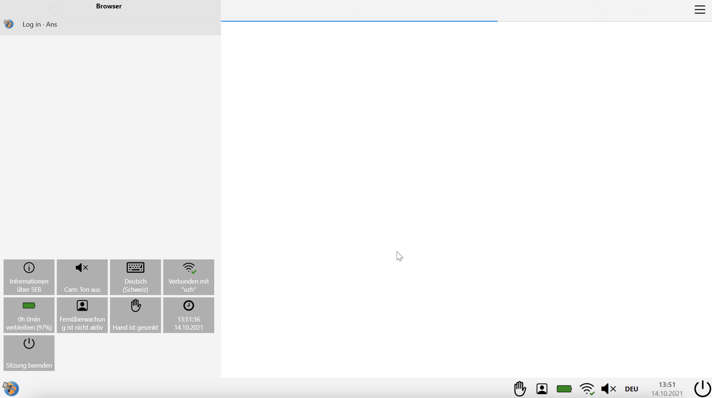
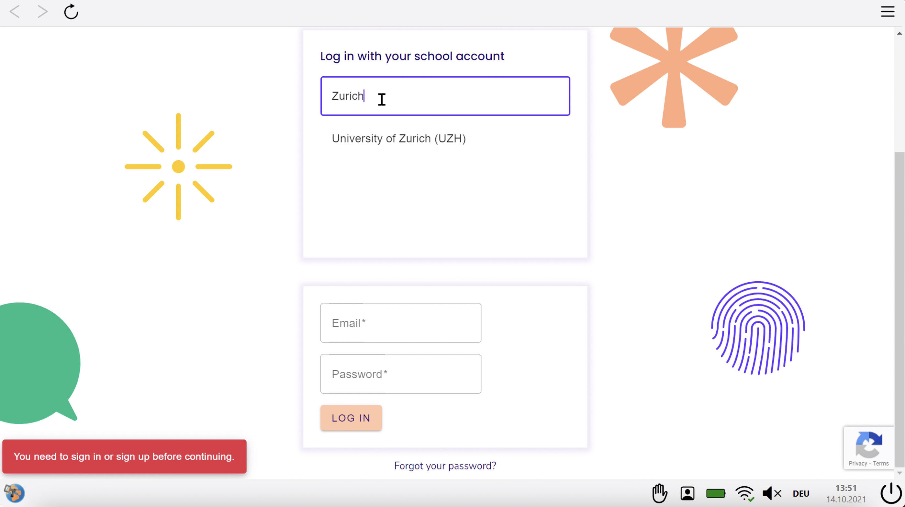
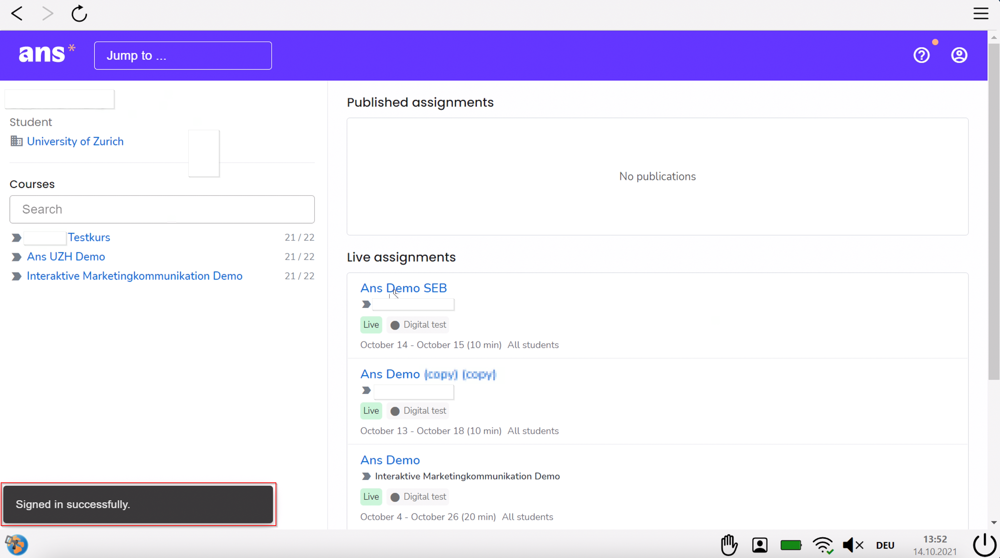
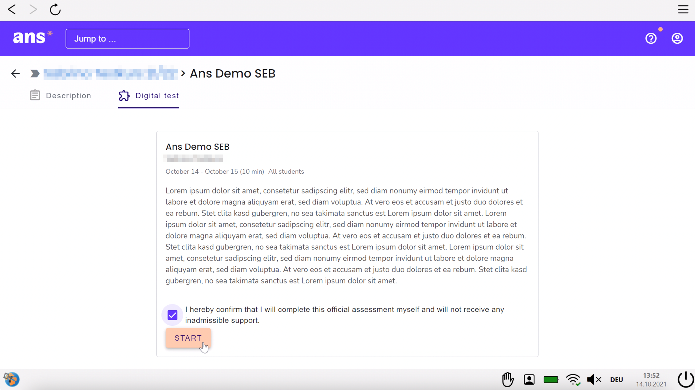
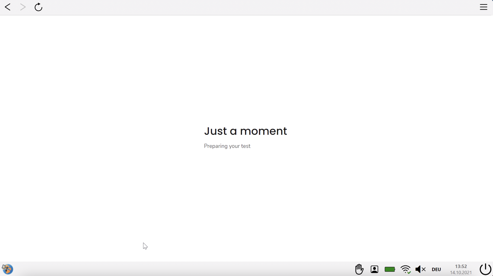
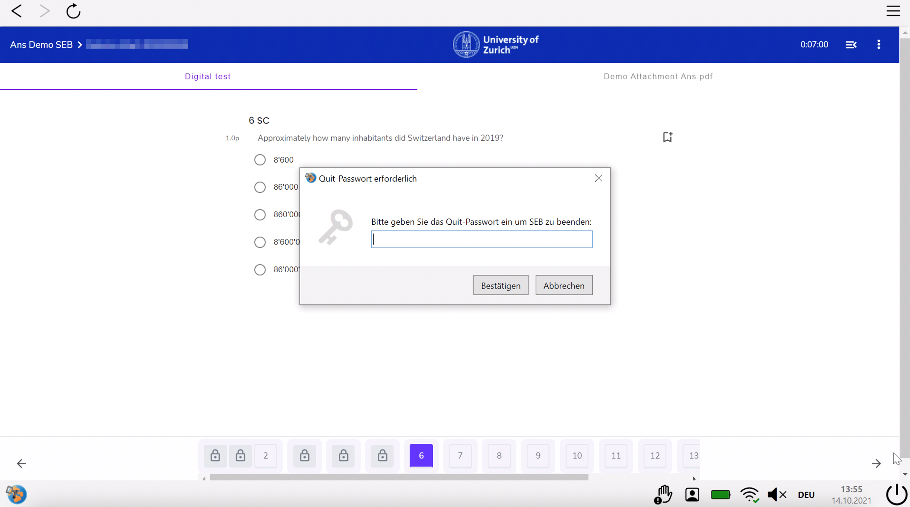
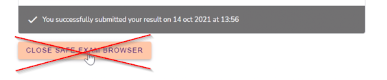

## SEB mit Ans (Windows)

### Start der Prüfung
Bitte beachten Sie die Checkliste unter [Allgemeine Informationen](https://uzh-oec.github.io/seb/exam_general_de.html){:target="_blank"}

1. 1. Sie erhalten zeitnah zu jeder Prüfung eine Konfigurationsdatei auf folgender Website: [https://oec.uzh.ch/de/seb](https://oec.uzh.ch/de/seb){:target="_blank"}

1. Klicken Sie auf die Schaltfläche **DATEINAME starten**

1. Öffnen Sie die Datei und klicken Sie **OK** bei der folgenden Anzeige

1. Der SEB startet 

1. Nur kurz zeigt sich folgendes Bild

1. Als Nächstes lädt der SEB die Ans Plattform. Wählen Sie die Login-Option "Login with school account" und geben Sie **Zurich** oder **UZH** ein und wählen **University of Zurich (UZH)** aus

1. Bitte loggen Sie sich mit dem SWITCHaai Login ein

1. Bei erfolgreichem Login wird Ihnen die Ans Plattform angezeit. 

1. Navigieren Sie nun zu der Prüfung:
* Hat die Prüfungszeit noch nicht begonnen, finden Sie die Prüfung unter **Scheduled assignments**
* Hat die Prüfung bereits gestartet, finden Sie die Prüfung unter **Live assignments**
Alle weiteren Informationen zu Ans finden Sie [hier](https://uzh-oec.github.io/ans/exam-navigation-de.html){:target="_blank"}

1. Wählen Sie den Prüfungskurs und wählen Sie die Start-Schaltfläche (falls die Prüfung noch nicht Life ist, sehen Sie diese **nach** dem Countdown)

1. Die Prüfung wird kurz geladen

1. Die Prüfung wird nun angezeigt.
Alle weiteren Informationen zu Ans finden Sie [hier](https://uzh-oec.github.io/ans/exam-navigation-de.html){:target="_blank"}

### Während der Prüfung

Der Safe Exam Browser weist am oberen und unteren Rand Symbole auf, welche hier genauer erläutert werden.

**Oben links:** 
* Back-Button
* Refresh-Button

**Oben rechts:**
* Menu-Icon

**Unten rechts:**
Von links nach rechts
* Profil-Icon
* Battery Icon
* Audio-Icon
* Spracheinstellung: Die Anzeige ist entweder **DEU** oder **EN** und bezieht sich auf die Tastatursprache
* Zeit und Datum
* Exit Knopf: bei Betätigung des Knopfes wird ein Passwort erfragt, welches der Administrator hat. Da das Beenden des Safe Exam Browsers nicht erlaubt ist, muss bei Betätigung dessen im Pop-Up **Abbrechen** gewählt werden

### Beenden der Prüfung
 
Sie dürfen den Safe Exam Browser **nicht** vor Prüfungsende beenden. Ein vorzeitiger Ausstieg aus dem Safe Exam Browser gilt als Prüfungsbetrug. Klicken Sie **NICHT** auf den Button «Safe Exam Browser schliessen» bevor die Prüfungszeit abgelaufen ist.

