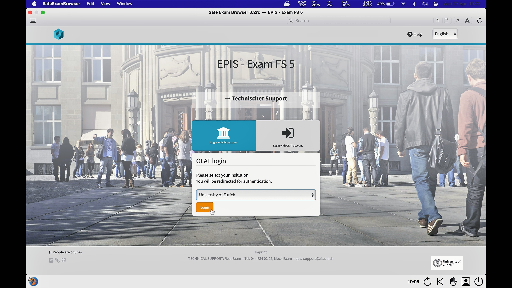
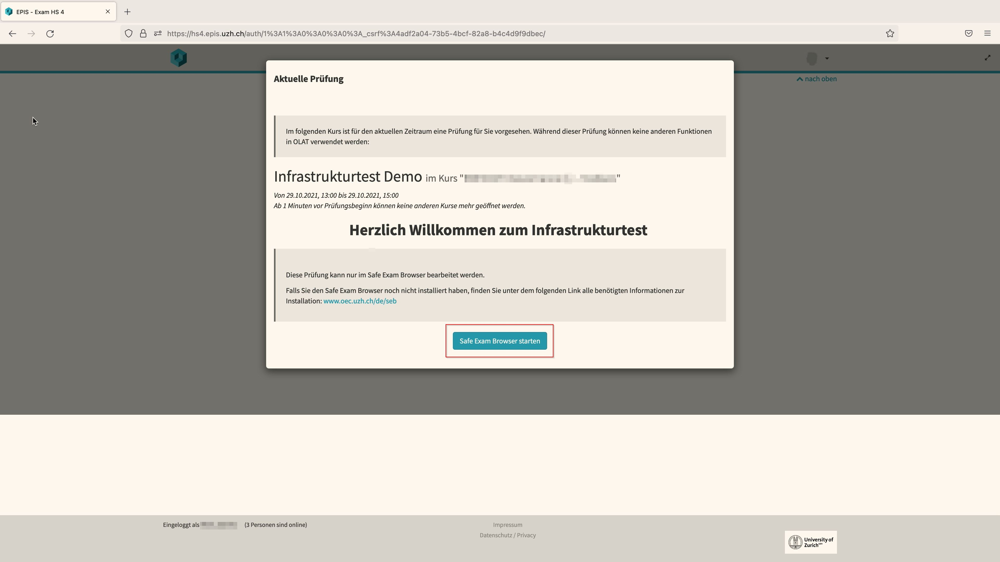
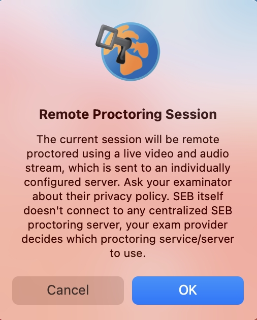
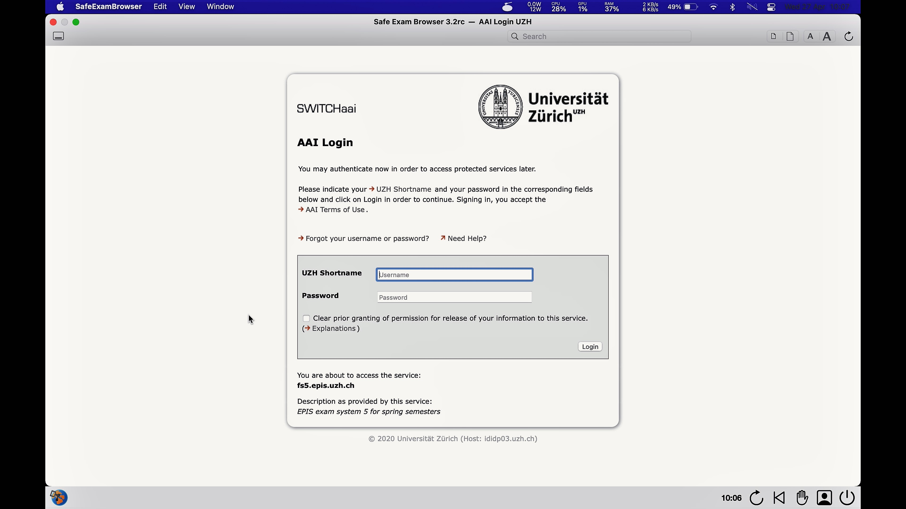

## SEB mit OLAT-EPIS (MacOS)
{: .no_toc }

This documentation explains how to use the Safe Exam Browser in an **OLAT-EPIS** exam.

1. Inhaltsübersicht
{:toc}

---

### Start an exam
Please make sure you have gone through the **checklist** before starting the exam [general information](exam_general)

1. Open the chrome / firefox browser and log into OLAT-EPIS using the aaiSWITCH Login: [https://fs5.epis.uzh.ch](http://fs5.epis.uzh.ch){:target="_blank"}

1. A pop-up appears, which displays the exam you are about to take. The window further explains that the exam can only be edited using the **Safe Exam Browser**. Click on the **Start Safe Exam Browser** button.

1. A window inserts on the top of the window suggesting to open the **Safe Exam Browser**. Press **Open Link**

1. While the SEB is starting, a pop-up will appear indicating that video monitoring is taking place. Press **OK** (it is possible that further pop-ups appear e.g. accessing camera & microphone or indicating that the SEB is closing an application).

1. In a next step the Safe Exam Browser will load the OLAT exam platform and asks you to log in again. 

1. Please log in using your SWITCHaai.

1. The exam is now being displayed.

### During an exam

Safe Exam Browser provides a variety of functions which, depending on the version, are displayed either on top or on the bottom of SEB or might not be available at all.

A detailed overview regarding icons and their function can be found here:
[Icons explained](icons_explained)

### Finish an exam
You are **not** allowed to quit the Safe Exam Browser before the end of exam time slot. Early exit from the Safe Exam Browser is considered exam fraud. Do **NOT** select the button «End Safe Exam Browser» before the exam time has elapsed.
