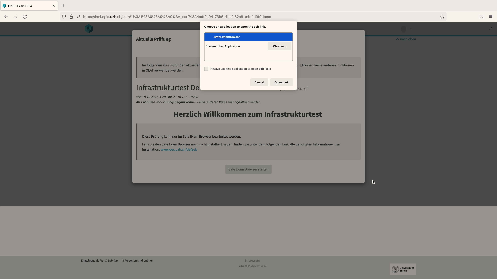
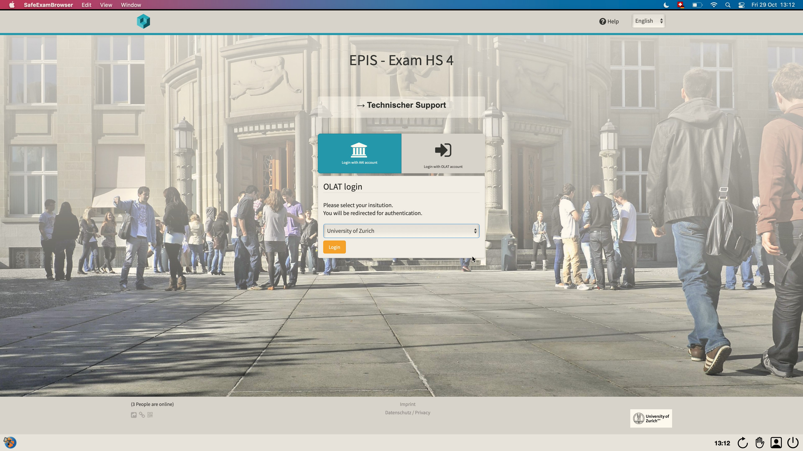
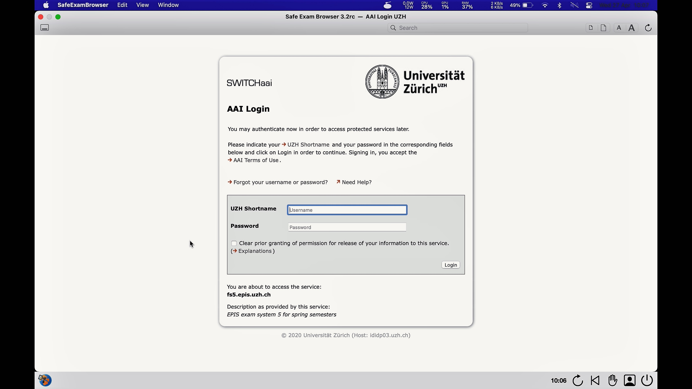

## SEB mit OLAT-EPIS (MacOS)

### Start der Prüfung

Bitte beachten Sie die Checkliste unter [Allgemeine Informationen](https://uzh-oec.github.io/seb/exam_general_de.html){:target="_blank"}

1. Loggen Sie sich im Firefox Browser auf OLAT-EPIS mit dem aaiSWITCH Login ein: [hs4.epis.uzh.ch](hs4.epis.uzh.ch){:target="_blank"}

1. Es erscheint ein Pop-Up, welches die Aktuelle Prüfung anzeigt. Darin wird erläutert, dass die Prüfung nur mit dem Safe Exam Browser bearbeitet werden kann. Klicken Sie auf die **Safe Exam Browser Starten** Schaltfläche

1. Ein Fenster zeigt die Applikation **Safe Exam Browser** an um die Prüfung zu starten. Klicken Sie **Link öffnen** / **Open Link**

1. Während der SEB startet, zeigt sich ein Pop-Up, welches darauf hinweist, dass ein Videoüberwachung stattfindet. Drücken Sie **OK**  (es ist durchaus möglich, dass weitere Pop-Ups erscheinen z.B. das Zugreifen auf Kamera & Mikrofon oder das Schliessen einer Applikation)

1. Als Nächstes lädt der Safe Exam Browser die Prüfungsplattform OLAT und bittet Sie erneut sich einzuloggen. 

1. Bitte loggen Sie sich mit dem SWITCHaai Login ein

1.  Die Prüfung wird nun angezeigt.

### Während der Prüfung

Der Safe Exam Browser weist am unteren Rand Symbole auf.

**Unten rechts:**
* Zeit
* Aktualisierungssymbol
* Handraise
* Profilicon
* Exit

### Beenden der Prüfung

(weitere Informationen folgen)
