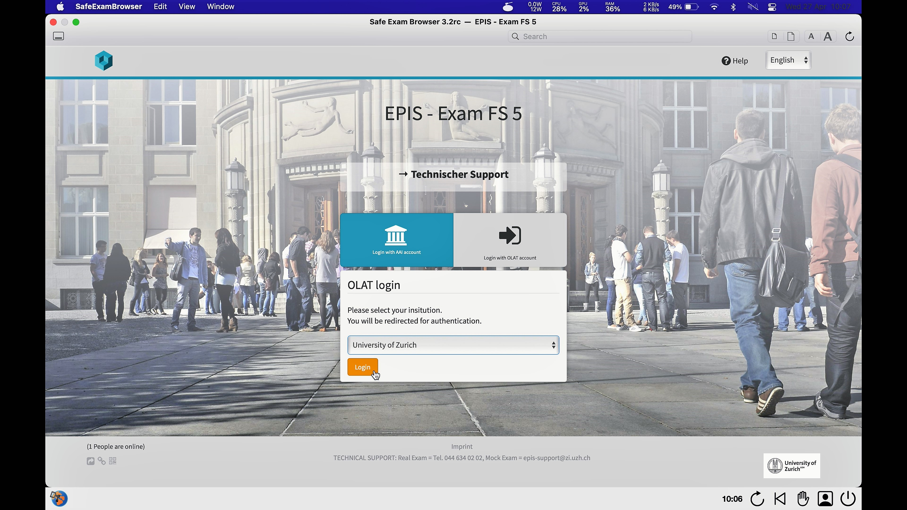

## SEB mit OLAT-EPIS (MacOS)
{: .no_toc }

This documentation explains how to use the Safe Exam Browser in an **OLAT-EPIS** exam.

1. Inhaltsübersicht
{:toc}

---

### Start an exam
Please make sure you have gone through the **checklist** before starting the exam [general information](https://uzh-oec.github.io/seb-en/exam_general_en.html){:target="_blank"}

1. Open the chrome / firefox browser and log into OLAT-EPIS using the aaiSWITCH Login: [hs4.epis.uzh.ch](hs4.epis.uzh.ch){:target="_blank"}

1. A pop-up appears, which displays the exam you are about to take. The window further explains that the exam can only be edited using the **Safe Exam Browser**. Click on the **Start Safe Exam Browser** button.

1. A window inserts on the top of the window suggesting to open the **Safe Exam Browser**. Press **Open Link**

1. While the SEB is starting, a pop-up will appear indicating that video monitoring is taking place. Press **OK** (it is possible that further pop-ups appear e.g. accessing camera & microphone or indicating that the SEB is closing an application).

1. In a next step the Safe Exam Browser will load the OLAT exam platform and asks you to log in again. 

1. Please log in using your SWITCHaai.

1. The exam is now being displayed.

### During an exam

The safe exam browser has a task bar at the bottom, where the following 

* Time
* **Profil-Icon**: this entails the video-proctoring. Depending on the settings made by the administrator you can click on it and are then able to see other people in the zoom room
* Refresh-Icon
* **Exit- Button**: when pressing the button, a password is requested, which only the administrator has. Since exiting the Safe Exam browser is not allowed, you must select **Cancel** in the pop-up when you press the button. Exiting the Safe Exam Browser AFTER submitting the exam is done with a button appearing in the EPIS-OLAT plattfrom.

### Finish an exam
You are **not** allowed to quit the Safe Exam Browser before the end of exam time slot. Early exit from the Safe Exam Browser is considered exam fraud. Do **NOT** select the button «End Safe Exam Browser» before the exam time has elapsed.

**Note**: When quitting the SEB using a MacOS, an pop-up appears containing an error message "Safe Exam Browser quit unexpectely". Please select **OK**

