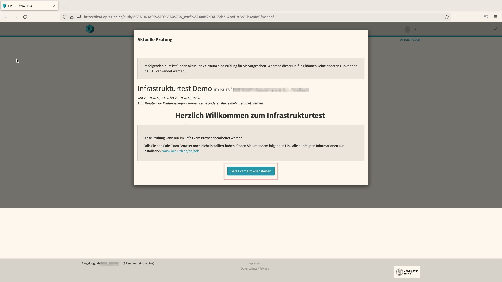

## SEB mit OLAT-EPIS (Windows)
{: .no_toc }

This documentation explains how to use the Safe Exam Browser in an **OLAT-EPIS** exam.

1. Inhaltsübersicht
{:toc}

---

### Start an exam
Please make sure you have gone through the checklist before starting the exam [general information](https://uzh-oec.github.io/seb-en/exam_general_en.html){:target="_blank"}

1. Open the chrome / firefox browser and log into OLAT-EPIS using the aaiSWITCH Login: [fs5.epis.uzh.ch](fs5.epis.uzh.ch){:target="_blank"}

1. A pop-up appears, which displays the exam you are about to take. The window further explains that the exam can only be edited using the **Safe Exam Browser**. Click on the **Start Safe Exam Browser** button.

1. A window suggest using the **Safe Exam Browser** to display the exam. Please press **Choose Application**

1. The SEB is starting

1. While the SEB is starting, a pop-up will appear indicating that video monitoring is taking place. Press **OK** (it is possible that further pop-ups appear e.g. accessing camera & microphone or indicating that the SEB is closing an application).

1. In a next step the Safe Exam Browser will load the OLAT exam platform and asks you to log in again.  

1. Please log in using your SWITCHaai.

1. The exam is now being displayed.

### During an exam

The Safe Exam Browser displays different symbols on the top and bottom bar, which are explained here.

**Top left:** 
* Back-Button
* Refresh-Button

**Top right:**
* Menu-Icon

**Bottom right:**
Left to right
* **Profil-Icon**: this entails the video-proctoring. Depending on the settings made by the administrator you can click on it and are then able to see other people in the zoom room
* Battery Icon
* Audio-Icon
* **Language Settings**: The language settings is referring to your keyboard language. You can toggle between the setthings you have installed on your device
* Date and Time
* **Exit-Button**: when pressing the button, a password is requested, which only the administrator has. Since exiting the Safe Exam browser is not allowed, you must select **Cancel** in the pop-up when you press the button. Exiting the Safe Exam Browser AFTER submitting the exam is done with a button appearing in the Ans plattfrom: see chapter **Finish an exam** below

### Finish an exam
You are **not** allowed to quit the Safe Exam Browser before the end of exam time slot. Early exit from the Safe Exam Browser is considered exam fraud. Do **NOT** select the button «End Safe Exam Browser» before the exam time has elapsed.
