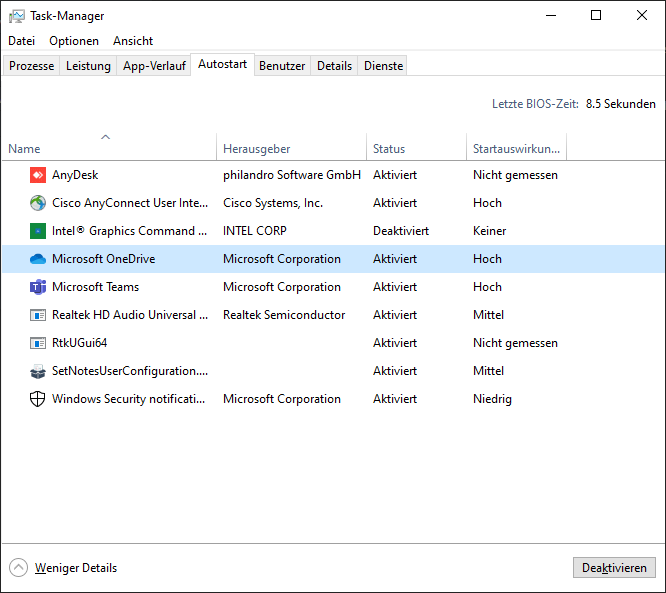
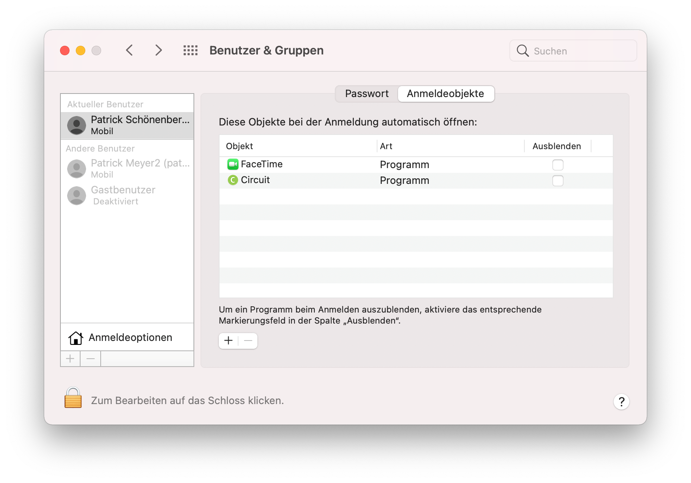

## Description
When opening Safe Exam Browser it can happen that after a while the screen start to flicker in rapid succession(going pack between SEB and the desktop). This makes it impossible to take an exam.

## Cause
So far this has been caused by an unauthorized software running in the background. This disturbes SEB and leads to the strange behavior.

## Solution
First you need to find out which software causes the issue. Therefore restart your computer and see if the problem still occurs.

**If it does not**, this means that the software which caused the issue was most likely not started automatically but rather by you. Try to remember which software you have started before and disable it. Then try to see if the error still occurs.

**If it does**, this means that the software was started automatically upon startup of your device. Try to find out which software gets started automatically.
In Windows you can see this in the Taskmanager under the tab Autostart.

On MacOS go to Users & Groups and look for Login Items.

Try now to disable one software after the other until you find the one which has caused the issue.
Make sure that the software which caused the issue is not running during an exam.