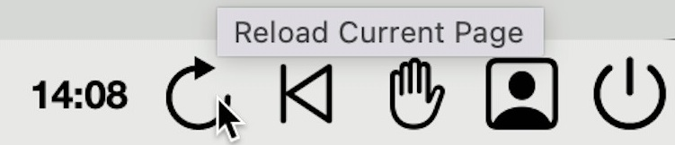
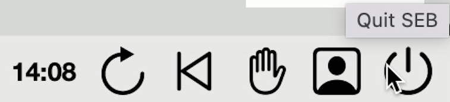

## Icons in Safe Exam Browser (SEB)
At the bottom of SEB you can find additional functionality which is briefly explained here.

On the far left the "SEB button" is located. By clicking this button the current page gets reloaded. This might be helpful if SEB only displays a black page instead of the exam.

On the far right you can find additonal icons. By clicking on "reload" the current page gets reloaded.

The button "Back to Start" should not be clicked as it forces SEB to jump back to the first page. Depending on the exam settings this might be a blank page and could lead to lost data.

By clicking the "hand" icon the exam team is notified that you need support. Depending on the operating system you are using a long press on this button opens a message dialogue. Through this dialogue you may also submit additonal info to the exam team regarding your problem.

After clicking on the "hand" icon it will turn yellow. You are now "raising" your hand virtually and a support person gets notified. If you accidentally clicked on the "hand" icon, you can "lower" your hand by clicking the "hand" icon again.

If the exam is proctored through camera recording the "proctoring button" is green. This means the feed from your camera is being streamed to the proctoring team.

By clicking on the "proctoring button" a Zoom window opens showing all participants of the exam. This window might be black if you are the only person currently taking the exam.

The button "quit" will close SEB and end the exam for you. Depending on the exam closing of SEB might only be possible through entering a password. This password will be given to you at the end of the exam by the exam team. To be safe never close the SEB if you are not told to do so. Closing SEB during an exam is considered fraud.

