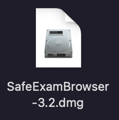
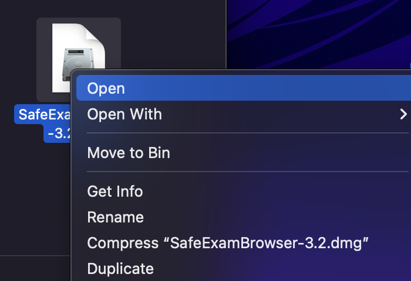
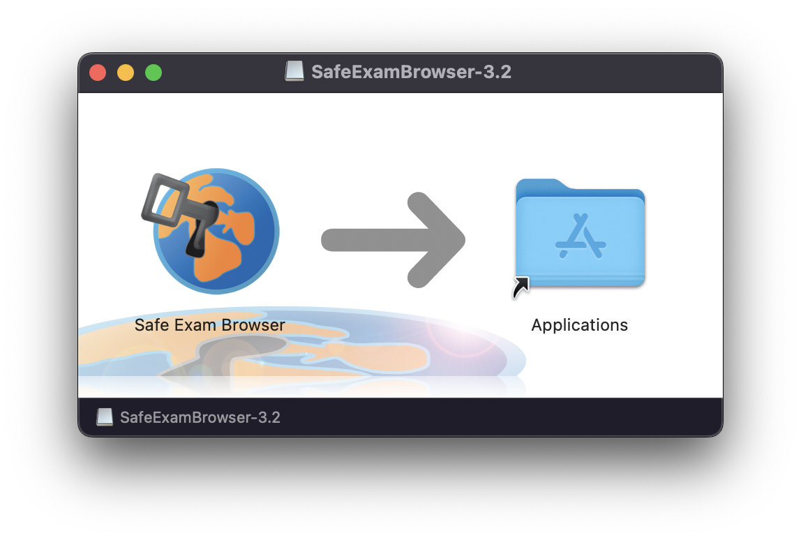
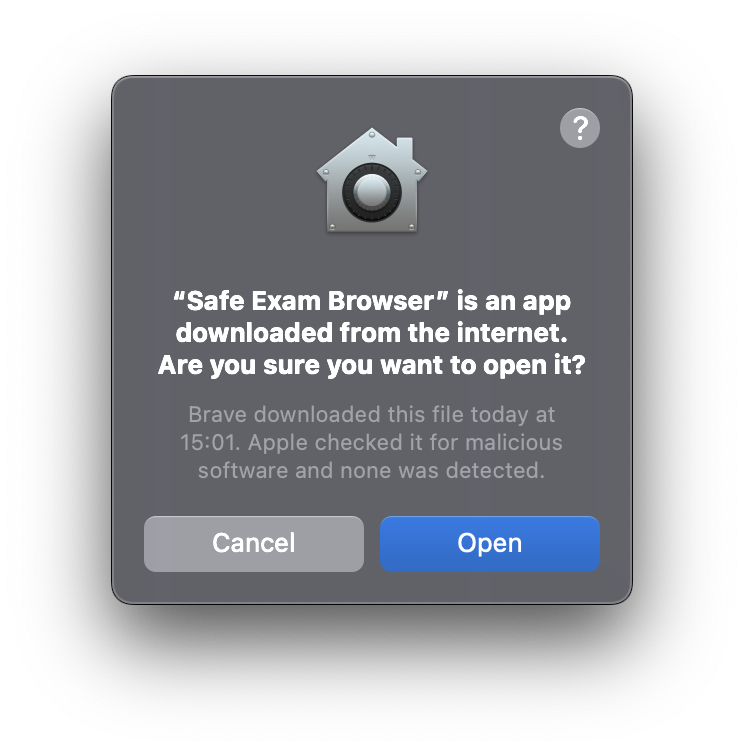

## Installation on MacOS

1. Download the recommended Safe Exam Browser version. The version is available to download on the following website: [https://oec.uzh.ch/en/seb](https://oec.uzh.ch/en/seb){:target="_blank"}

1. Download the file & open the downloaded program:
* By double clicking on the icon

    

* Or with a right mouse click and selecting «open».

    

1. A pop-up appears, instructing you to drag and drop the "Safe Exam Browser" icon into the Application Folder 

1. Close the installation window and search for "Safe Exam Browser" in your search function at the bottom left. If you can find SEB then it was installed correctly. **Note**: In order to test the installation, a valid configuration file is needed. This configuration file might be given to you by the exam team.

**Note**: the **configuration file** is specific to each test / exam and is provided on [https://oec.uzh.ch/en/seb](https://oec.uzh.ch/de/seb){:target="_blank"}. Since the set-up depends on your operating system as well as the learning management system the exam is written on, please follow the respective chapter:

* [Ans & SEB mit MacOS](exam_seb_ans_mac)
* [EPIS-OLAT & SEB mit MacOS](exam_seb_epis_mac)

If you have problems installing the application, please follow the steps [here](installation_problems).

