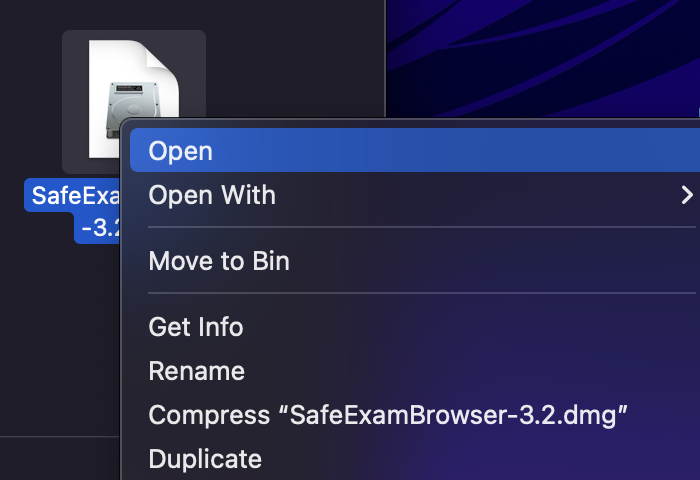

## Installation auf MacOS

1. Laden Sie folgende SEB Version für MacOS herunter:
Version 3.2, Download auf der folgenden Seite: [https://oec.uzh.ch/de/seb](https://oec.uzh.ch/de/seb){:target="_blank"}

1. Laden Sie die Datei herunter & öffnen Sie das heruntergeladene Programm:
* Mit Doppelklicken auf das Icon 
    
* Mit der rechten Mausttaste & «öffnen» / «open»
    

1. Es erscheint ein Pop-Up, welches Sie anweist das «Safe Exam Browser» Icon anhand der Maus in den Programm-Ordner / Application Folder zu ziehen 

1.	Gehen Sie nun zu Ihrem Programm-Ordner / Applications Folder und öffnen Sie den Safe Exam Browser. Beim Öffnen werden Sie nochmals darauf hingewiesen, dass es sich um eine heruntergeladene Applikation aus dem Internet handelt. Öffnen Sie das Programm

1. Beim erstmaligen Öffnen des Safe Exam Browser wird Ihnen die Startseite angezeigt. Dabei werden Sie darauf hingewiesen, dass der Safe Exam Browser noch nicht fertig konfiguriert ist und erläutert die weiteren Schritte. 

Sollten Sie Probleme bei der Installation der Applikation haben, folgen Sie bitte den Schritten [hier](https://uzh-oec.github.io/seb/installation_probleme.html){:target="_blank"}.

**Hinweis**: Für die Prüfung erfolgt das Starten des SEB bei Ans und OLAT-EPIS auf verschiedene Weise, ziehen Sie hierfür bitte die Erläuterung der jeweiligen Supportseiten heran (siehe "SEB & Ans" bzw. "SEB & EPIS")
