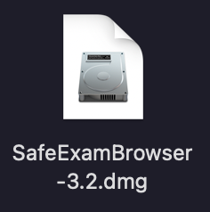
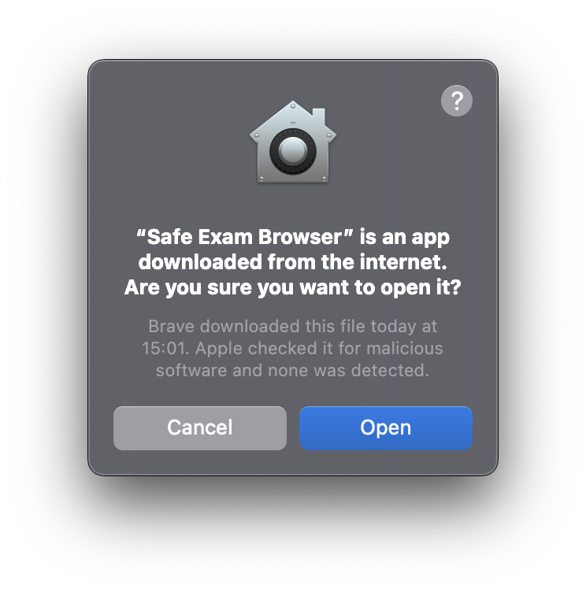

## Installation on MacOS

1. Download the newest Safe Exam Browser version:
Version 3.2pre3, the version is available to downlaod on the following website: [https://oec.uzh.ch/en/seb](https://oec.uzh.ch/en/seb){:target="_blank"}

1. Download the file & open the downloaded program:
* By double clicking on the icon 
    
* With a right mouse click and selecting «open»
    

1. A pop-up appears, instructing you to drag and drop the "Safe Exam Browser" icon into the Application Folder 

1.	Now navigate to the Applications Folder and open the Safe Exam Browser. When you open it, you will be reminded again that it is a downloaded application from the Internet. Open the program

1. When you open the Safe Exam Browser for the first time, the start page is displayed. You will be informed that the Safe Exam Browser is not yet fully configured as it needs a **configuration file**

1. Close the SEB again.

**Note**: the **configuration file** is specific to each test / exam and is provided on[https://oec.uzh.ch/de/seb](https://oec.uzh.ch/de/seb){:target="_blank"}. Since the set-up depends on your operating system as well as the learning management system the exam is written on, please follow the respective chapter:
* [Ans & SEB with Windows](https://uzh-oec.github.io/seb-en/exam_seb_ans_win_en.html){:target="_blank"}.
* [Ans & SEB with MacOS](https://uzh-oec.github.io/seb-en/exam_seb_ans_mac_en.html){:target="_blank"}.
* [EPIS-OLAT & SEB with Windows](https://uzh-oec.github.io/seb-en/exam_seb_epis_win_en.html){:target="_blank"}.
* [EPIS-OLAT & SEB with MacOS](https://uzh-oec.github.io/seb-en/exam_seb_epis_mac_en.html){:target="_blank"}.

**If you have problems installing the application, please follow the steps [here](https://uzh-oec.github.io/seb-en/installation_problems.html){:target="_blank"}.**

