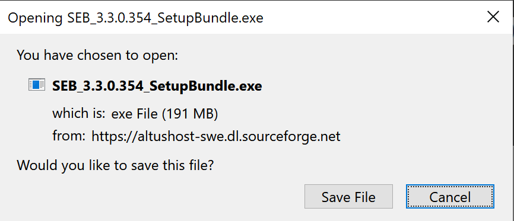
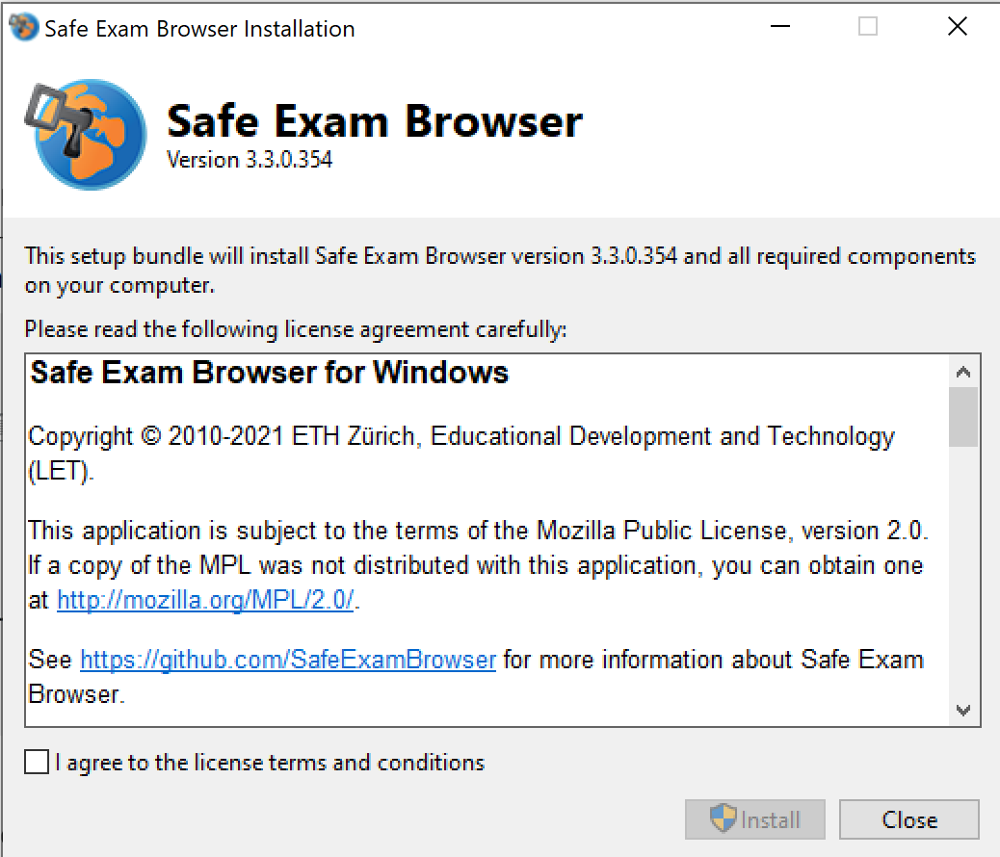
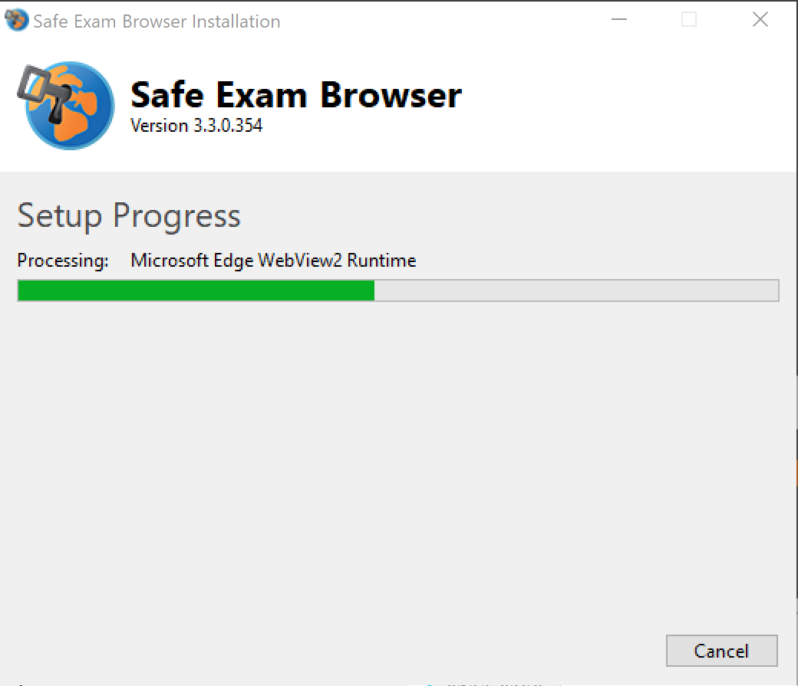
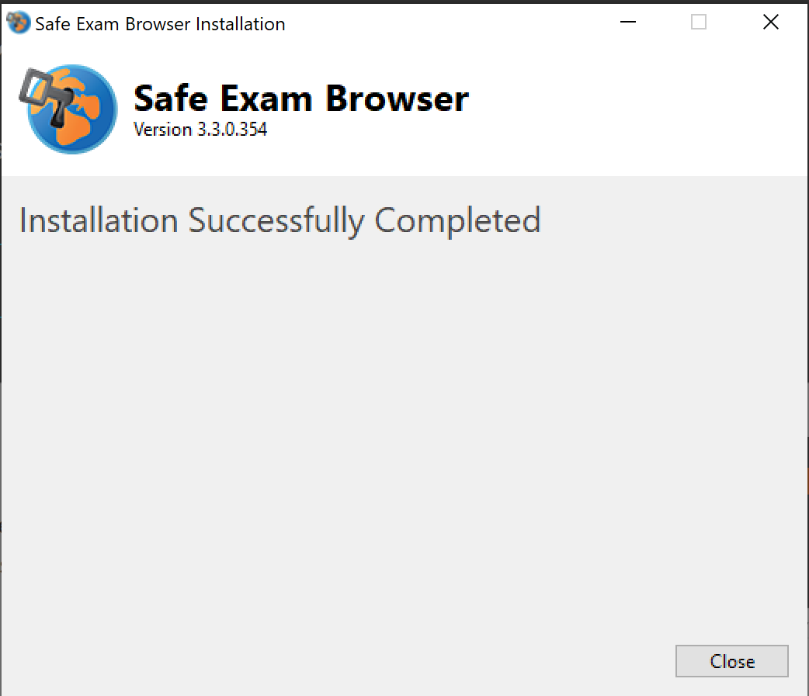
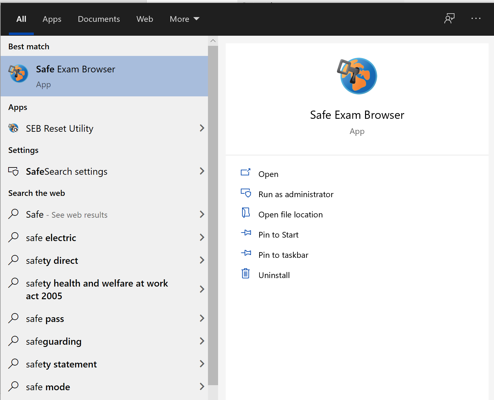
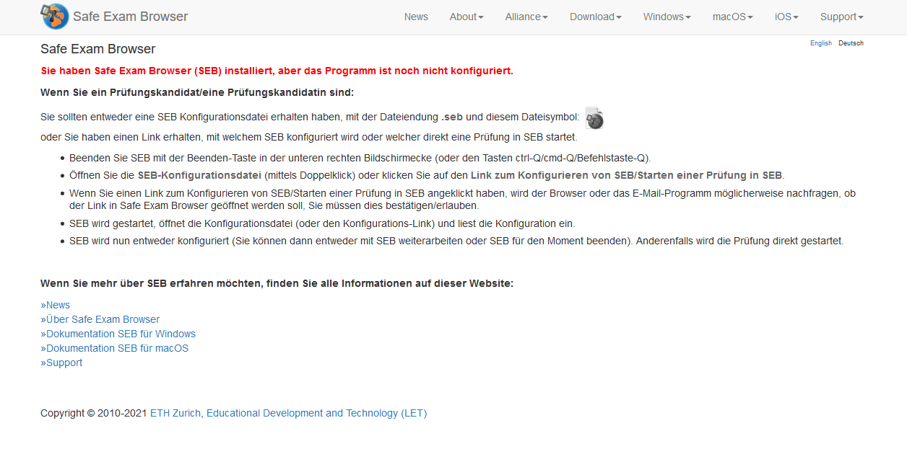

## Installation auf Windows

1. Laden Sie folgende SEB Version für Windows herunter:
Version 3.3.0, Download auf der folgenden Seite: [https://oec.uzh.ch/de/seb](https://oec.uzh.ch/de/seb){:target="_blank"}

1. Laden Sie den Safe Exam Browser herunter und speichern Sie die Datei (save File)

1. Öffnen Sie die heruntergeladene Datei in Ihren Downloads(Doppelklicken oder rechte Maustaste & Öffnen)

1. Wählen Sie die Box «I agree to the license terms and conditions» und drücken Sie «Install»

1. Der Safe Exam Browser wird installiert

1. Ist der Safe Exam Browser installiert, wird dies wie folgt angezeigt:

1. Schliessen Sie das Installationsfenster und suchen Sie in Ihrer Suchfunktion unten links nach «Safe Exam Browser» & öffnen Sie die Applikation

1. Beim Öffnen des Safe Exam Browser wird Ihnen die Startseite angezeigt. Dabei werden Sie darauf hingewiesen, dass der Safe Exam Browser noch nicht fertig konfiguriert ist und erläutert die weiteren Schritte.

Sollten Sie Probleme bei der Installation der Applikation haben, folgen Sie bitte den Schritten [hier](https://uzh-oec.github.io/seb/installation_probleme.html){:target="_blank"}.

**Hinweis**: Für die Prüfung erfolgt das Starten des SEB bei Ans und OLAT-EPIS auf verschiedene Weise, ziehen Sie hierfür bitte die Erläuterung der jeweiligen Supportseiten heran (siehe "SEB & Ans" bzw. "SEB & EPIS")