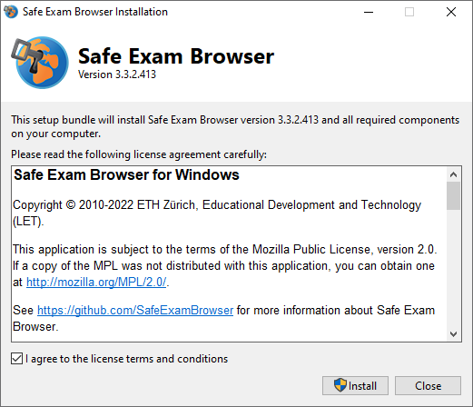

## Installation on Windows

1. Download the following SEB version for Windows:
Version 3.3.2 from the following page: [https://www.oec.uzh.ch/en/seb](https://oec.uzh.ch/en/seb){:target="_blank"}

1. Open the downloaded file in your downloads (double click or right mouse button & open)

1. Tick the box "I agree to the license terms and conditions" and press "Install".

1. The Safe Exam Browser is being installed

1. Once the Safe Exam Browser is installed, the following is being displayed:

1. Close the installation window and search for "Safe Exam Browser" in your search function at the bottom left. If you can find SEB then it was installed correctly. **Note**: In order to test the installation, a valid configuration file is needed. This configuration file might be given to you by the exam team.

**Note**: the **configuration file** is specific to each test / exam and is provided on [https://www.oec.uzh.ch/en/seb](https://www.oec.uzh.ch/en/seb){:target="_blank"}. Since the set-up depends on your operating system as well as the learning management system the exam is written on, please follow the respective chapter:
* [Ans & SEB with Windows](https://uzh-oec.github.io/seb-en/exam_seb_ans_win_en.html){:target="_blank"}.
* [Ans & SEB with MacOS](https://uzh-oec.github.io/seb-en/exam_seb_ans_mac_en.html){:target="_blank"}.
* [EPIS-OLAT & SEB with Windows](https://uzh-oec.github.io/seb-en/exam_seb_epis_win_en.html){:target="_blank"}.
* [EPIS-OLAT & SEB with MacOS](https://uzh-oec.github.io/seb-en/exam_seb_epis_mac_en.html){:target="_blank"}.

If you have problems installing the application, please follow the steps [here](https://uzh-oec.github.io/seb-en/installation_problems_en.html){:target="_blank"}.

