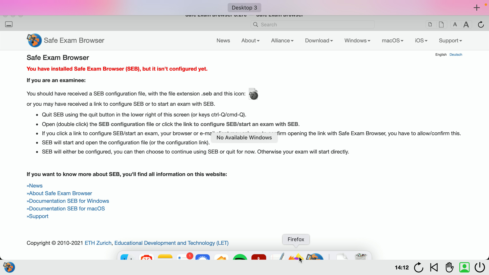

## Open Book in Safe Exam Browser (SEB)
Your exam might be held as an Open Book Exam in SEB. Depending on the exam this allows you to use certain software during the exam such as Word, PPT, PDF or others. However, since SEB hiddes your toolbar / dock you must practise opening software during a SEB exam beforehand since it might be quite different than of what you are used to.

**Windows by Microsoft**
If you are using MS Windows you can open your start menu by clicking the "windows key" on your keyboard. In the start menu you should be able to search and start your desired software (e.g., firefox)

Another way to access your software is by using "swipe-gestures" on the touchpad of your notebook. Swipe up (away from yourself) using 3 fingers on the touchpad shows priorly opened software. For more information regarding "swipe gestures" search for "touch gestures" on the official Windows support page.

**MacOS by Apple**
If you are using MacOS software can currently only be accessed through the usage of "swipe gestures". Swipe up with 3 fingers on your touchpad in order to bring up your dock. Currently the dock will not be fully displayed and is partially hidden by SEB. Nevertheless, you should still be able to open your desired software. For more information regarding "swipe gestures" search for "touch gestures" on the official Apple support page.

**Note**
As preparation for an open book exam conducted in SEB you should take following steps.
Make sure that all software you might use during the exam is already pinned to your toolbar / dock before the exam.
You can also open up software you might need before the exam. SEB will keep allowed software open in the background. This might help you accessing software quicker and might safe you time on the exam and makes software easier to find.
